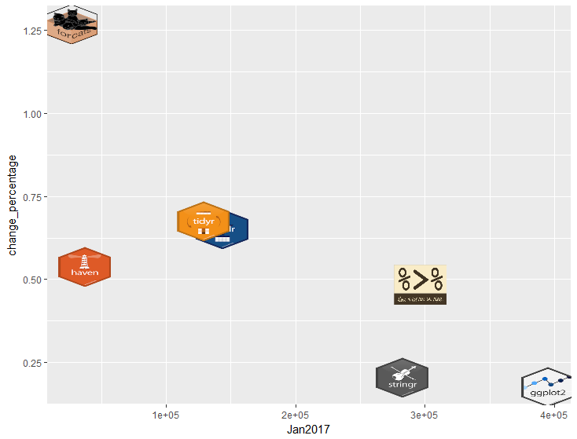

ggicons
-----------
Icon geom for ggplot2

Lets you create scatter plots using custom icons.
# Installing

``` r
devtools::install_github(PatrickRobotham/ggicons)
```

# Usage

```r
library(ggicon)
library(dplyr)
library(devtools)
data(tidyverse_downloads)
downloads_with_icon <- tidyverse_downloads %>%
  mutate(file_path = system.file("icons",paste0(package,".png"), package = "ggicons"))
ggplot(downloads_with_icon, aes(x = Jan2017, y = change_percentage, file_path = file_path)) +
   geom_icon()

```


